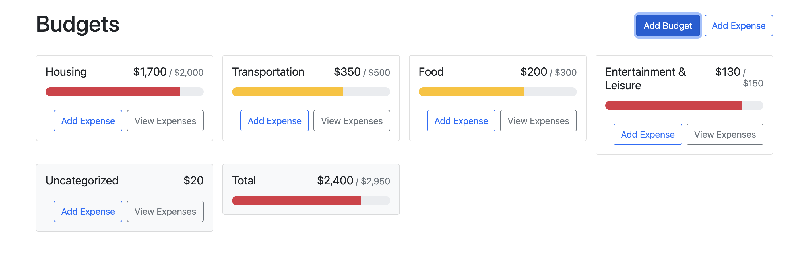

# Budget Management App

This project is a React app designed to help users manage their budgets and expenses effectively. It provides an intuitive interface for creating budgets, tracking expenses, and visualizing spending across different categories.

## Features

- Add Budgets: Create budgets with a name and spending limit.
- Track Expenses: Add expenses to specific budgets or an "Uncategorized" category.
- View Expenses: View detailed lists of expenses for each budget.
- Uncategorized Expenses: Manage expenses that don't belong to any specific budget.
- Total Budget Overview: See a summary of all budgets and expenses in one place.
- Responsive Design: The app is fully responsive and adapts to different screen sizes.

## Technologies Used

- React: For building the user interface.
- React Bootstrap: For styling and layout components.
- Custom Context API: For managing budgets and expenses globally across the app.
- React Hooks: For managing state and side effects.

## How It Works

Budgets:

- Users can create budgets with a name and a maximum spending limit.
- Budgets are displayed as cards, showing the current spending and the limit.

Expenses:

- Users can add expenses to specific budgets or leave them uncategorized.
- Each expense includes an amount and is associated with a budget.

Modals:

- The app uses modals for adding budgets, adding expenses, and viewing expenses for a specific budget.

Uncategorized and Total Budgets:

- The "Uncategorized" card displays expenses that are not assigned to any budget.
- The "Total Budget" card provides an overview of all budgets and expenses.

## Installation

1. Clone the repository.
2. Install dependencies.
3. Start the development server.
4. Open the app in your browser.
